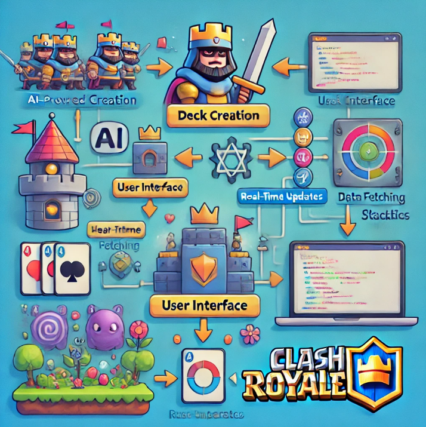

# API Documentation

## Overview
DeckMateAI integrates data from popular gaming APIs to provide enhanced features and insights. Our system utilizes the official APIs of **Clash Royale** and **Brawl Stars** to fetch real-time data, ensuring accurate and up-to-date information for users.

## APIs Used

### Clash Royale Official API
We leverage the Clash Royale API to access player profiles, clan data, leaderboard statistics, and game events. This data enables DeckMateAI to deliver personalized recommendations and analytics tailored to individual players.

- **Documentation**: [Clash Royale API](https://developer.clashroyale.com/)
- **Key Features**:
  - Player stats retrieval.
  - Clan and leaderboard data integration.
  - Tournament and event insights.

---

### Brawl Stars Official API
The Brawl Stars API is used to fetch player stats, club information, and event data. This integration powers DeckMateAI's analysis and strategy tools for Brawl Stars players.

- **Documentation**: [Brawl Stars API](https://developer.brawlstars.com/)
- **Key Features**:
  - Player profile and performance tracking.
  - Club analytics and leaderboard statistics.
  - Event and mode analysis.

---

## Proxy Server Integration
To ensure seamless and secure access to these APIs, DeckMateAI employs a proxy server. This setup:
- Enhances API request efficiency by managing rate limits.
- Ensures data security through controlled access.
- Provides a layer of abstraction for API interactions, allowing scalable integrations.