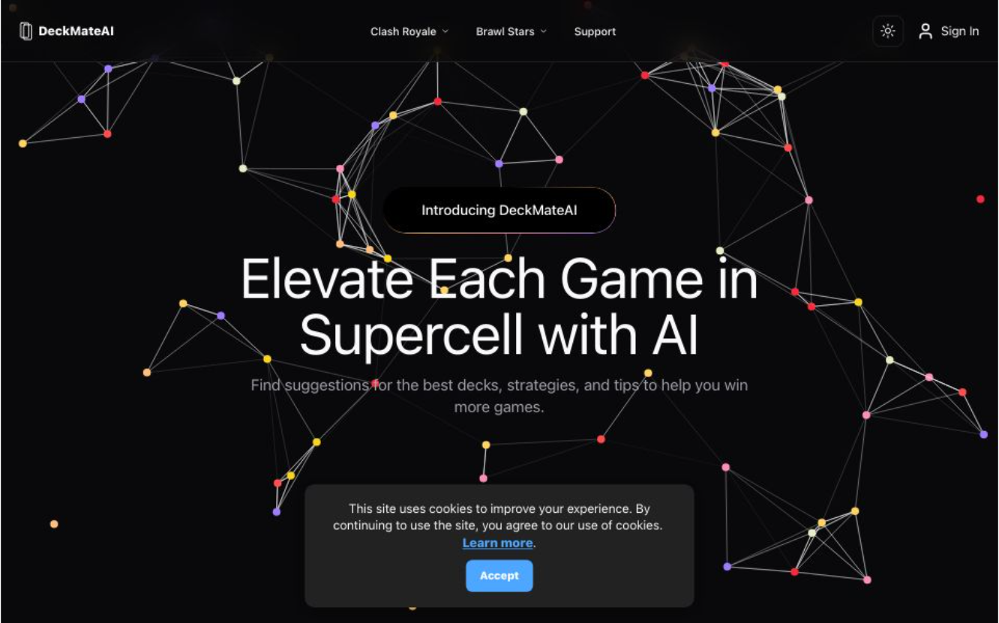
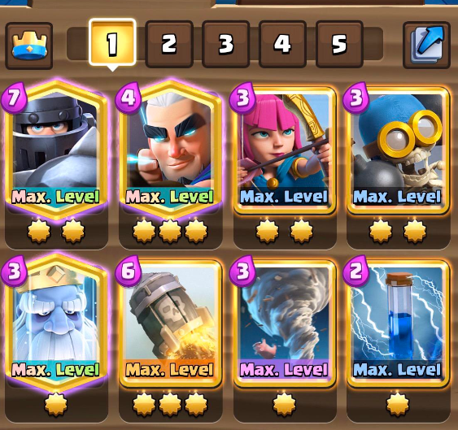

# Project Idea

DeckMateAI is an innovative tool designed to help Clash Royale players create powerful, personalized decks using AI technology. It allows users to build decks based on their preferred strategies and card choices while staying current with game updates. DeckMateAI offers two main options for deck creation: OpenAI-based recommendations and algorithm-driven suggestions, along with comprehensive deck management features.

### AI-Powered Deck Creation
DeckMateAI generates tailored decks through AI insights:
- **Recommendation Modes**:
  - **OpenAI Suggestions**: Input preferences for AI-generated decks.
  - **Algorithmic Recommendations**: Analyze card synergies for optimal strategies.
- **Enhanced Strategy**: Discover effective combinations for offense, defense, and elixir management.

---

### User-Friendly Interface
The interface is designed for ease of use:
- **Cards**: Browse and select cards with detailed stats.
- **Copy Deck Functionality**: Copy your favorite deck
- **Custom Themes**: Choose between light and dark modes for a personalized experience.

---

### Real-Time Updates
Stay informed with the latest game changes:
- **Live Data Integration**: Automatic updates for new card releases and balance changes.
- **In-Game Relevance**: Create decks that reflect the current meta.

---

### Deck Management and Statistics
Efficiently manage and analyze your decks:
- **Save and Delete Options**: Organize multiple deck variations easily.
- **Performance Metrics**: Review win rates, elixir costs, and other stats to refine strategies.
- **Deck Comparison**: Analyze different decks to optimize performance.